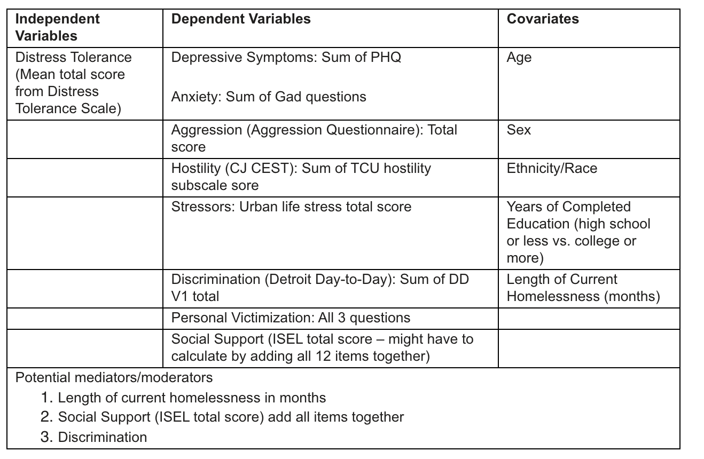

# ⭐️Overview

**2021-03-11, from Michael Businelle**

Hi Michael. Here are the analyses that we would like you to run for the first Link2Care paper.

**2021-04-16, Meeting with Michael Businelle**

- IV’s: 4 DTS sub scales
- DV’s: depression, hostility, urban life stress, and aggression
- Adjust:  Same as before
- Add these new analyses to the existing word document



**NOTE on source data**

Eventually, it would be nice to use the single, complete analysis data set that we are creating. For now, there is a ton of data management in this code.

# 📦Load packages

```{r message=FALSE}
library(dplyr)
library(haven)
library(officer)
library(ggplot2)
library(ggpubr)
library(meantables)
library(freqtables)
library(broom)
library(VGAM)
library(psych)
library(stringr)
library(purrr)
library(flextable)
```

# 🌎Connect to UTH server 

```{bash eval=FALSE}
# Don't drill all the way down to live documents because not all of the data is in live documents.
open 'smb://islgpcifs.uthouston.edu/sph_research/Link2Care/'
```

# 📥Import data 

The dts_paper.sav data is created in data_02_clean.Rmd

```{r}
dts_df <- read_sav("data/dts_paper.sav")
```

```{r}
dim(dts_df) # 245  36
```


# 📝Load analysis report template for officer

```{r}
dts_report <- read_docx("docs/dts_analysis_report_template.docx") %>% 
  body_replace_text_at_bkm("date", as.character(Sys.Date()))
```


# 📈Analysis


DT is defined as one’s perceived or behavioral capacity to withstand distress related to affective, cognitive, and/or physical states (Simons & Gaher, 2005; Zvolensky, Bernstein, & Vujanovic, 2011). Lower DT has been found to be associated with increased mental health problems and addictive behavior as well as physical health problems (Buhr and Dugas, 2010; Leyro et al., 2010).

The purpose of this study was to: 
1) evaluate the association between DT and psychosocial variables in homeless adults, including XYZ; and 
2) examine the buffering effect of social support for these relationships. 

Hypotheses:
1) It was hypothesized that total lifetime homelessness will be negatively related DT. 
2) It was hypothesized that lower DT would relate to increased depression, aggression, hostility, perceived stress, anxiety, perceived discrimination, and recent victimization among this vulnerable group. 
3) Additionally, it was hypothesized that social support would buffer the effect of DT on outcomes such that the association between DT and outcomes would be weaker among those who report higher social support. 

## 1️⃣Univariate analysis

### Distress tolerance scale

```{r eval=FALSE}
dts_df %>% 
  mean_table(dts_total_v2)
```

```{r eval=FALSE}
ggplot(dts_df) +
  geom_histogram(aes(x = dts_total_v2))
```

#### DTS: Tolerance subscale

```{r eval=FALSE}
dts_df %>% 
  mean_table(dts_tolerance_v2)
```

```{r eval=FALSE}
ggplot(dts_df) +
  geom_histogram(aes(x = dts_tolerance_v2), binwidth = .5)
```

#### DTS: Absorption subscale

```{r eval=FALSE}
dts_df %>% 
  mean_table(dts_absorption_v2)
```

```{r eval=FALSE}
ggplot(dts_df) +
  geom_histogram(aes(x = dts_absorption_v2), binwidth = .5)
```

#### DTS: Appraisal subscale

```{r eval=FALSE}
dts_df %>% 
  mean_table(dts_appraisal_v2)
```

```{r eval=FALSE}
ggplot(dts_df) +
  geom_histogram(aes(x = dts_appraisal_v2), binwidth = .5)
```

#### DTS: Regulation subscale

```{r eval=FALSE}
dts_df %>% 
  mean_table(dts_regulation_v2)
```

```{r eval=FALSE}
ggplot(dts_df) +
  geom_histogram(aes(x = dts_regulation_v2), binwidth = .5)
```

### Age

```{r eval=FALSE}
dts_df %>% 
  mean_table(age)
```

```{r eval=FALSE}
ggplot(dts_df) +
  geom_histogram(aes(x = age), binwidth = 2)
```

### Sex

```{r eval=FALSE}
dts_df %>% 
  freq_table(gender_v1_f)
```

### Race/Ethnicity

```{r eval=FALSE}
dts_df %>% 
  freq_table(race_eth_4_cat_f)
```

### Education

```{r eval=FALSE}
dts_df %>% 
  freq_table(high_school_grad_f)
```

### Lifetime homelessness

In months.

```{r eval=FALSE}
dts_df %>% 
  mean_table(homeless_time_total)
```

```{r eval=FALSE}
ggplot(dts_df) +
  geom_histogram(aes(x = homeless_time_total))
```

### Current homelessness

In months. I think the team may want to consider this an effect modifier.

```{r eval=FALSE}
dts_df %>% 
  mean_table(homeless_current_total)
```

```{r eval=FALSE}
ggplot(dts_df) +
  geom_histogram(aes(x = homeless_current_total))
```

### O: Depressive symptoms: PHQ 8

The current plan is for this to be an outcome variable.

```{r eval=FALSE}
dts_df %>% 
  mean_table(PHQ_dep_dichot_total)
```

```{r eval=FALSE}
ggplot(dts_df) +
  geom_histogram(aes(x = PHQ_dep_dichot_total), binwidth = 1)
```

### O: Anxiety: GAD 7

The current plan is for this to be an outcome variable. 

```{r eval=FALSE}
dts_df %>% 
  mean_table(gad_7_total_v1)
```

```{r eval=FALSE}
ggplot(dts_df) +
  geom_histogram(aes(x = gad_7_total_v1), binwidth = 1)
```

### O: Aggression

The current plan is for this to be an outcome variable. 

```{r eval=FALSE}
dts_df %>% 
  mean_table(aggression_total)
```

```{r eval=FALSE}
ggplot(dts_df) +
  geom_histogram(aes(x = aggression_total), binwidth = 2)
```

### O: Hostility

The current plan is for this to be an outcome variable. 

```{r eval=FALSE}
dts_df %>% 
  mean_table(tcu_hs_v2_total)
```

```{r eval=FALSE}
ggplot(dts_df) +
  geom_histogram(aes(x = tcu_hs_v2_total))
```

### O: Urban life stress

The current plan is for this to be an outcome variable.

```{r eval=FALSE}
dts_df %>% 
  mean_table(uls_v2_total)
```

```{r eval=FALSE}
ggplot(dts_df) +
  geom_histogram(aes(x = uls_v2_total))
```

### O: Discrimination 

The current plan is for this to be an outcome variable.
I think the team may also want to consider this an effect modifier.

```{r eval=FALSE}
dts_df %>% 
  mean_table(ddd_v1_total)
```

```{r eval=FALSE}
ggplot(dts_df) +
  geom_histogram(aes(x = ddd_v1_total))
```

### O: Personal victimization

The current plan is for these to be outcome variables.

#### Q1

In the past 30 days, has anyone used violence, such as in a mugging, fight, or sexual assault, against you?

```{r eval=FALSE}
dts_df %>% 
  freq_table(pv_violence_victim_30_f)
```

#### Q2 

In the past 30 days, how many times have you been a witness to acts of violence?

```{r rows.print=12}
dts_df %>% 
  freq_table(pv_witness_violence_30_f)
```

#### Q3

In the past 6 months, how many times have you been a witness to acts of violence?

```{r eval=FALSE}
ggplot(dts_df) +
  geom_histogram(aes(x = pv_witness_violence_30))
```

```{r rows.print=12}
dts_df %>% 
  freq_table(pv_witness_violence_6_f)
```

```{r eval=FALSE}
ggplot(dts_df) +
  geom_histogram(aes(x = pv_witness_violence_6))
```

### O: Social support

The current plan is for this to be an outcome variable.
I think the team may also want to consider this an effect modifier.

```{r eval=FALSE}
dts_df %>% 
  mean_table(ise_total)
```

```{r eval=FALSE}
ggplot(dts_df) +
  geom_histogram(aes(x = ise_total))
```

## 2️⃣Multivariate relationships

### 🔴Age & DTS

```{r eval=FALSE}
ggplot(dts_df, aes(x = dts_total_v2, y = age)) +
  geom_jitter() +
  geom_smooth() +
  geom_text(
    aes(x = 4.5, y = 65, label = paste("r = ", cor(dts_total_v2, age))),
    col = "blue"
  ) + 
  theme_bw()
```

```{r eval=FALSE}
cor.test(dts_df$dts_total_v2, dts_df$age)
```

```{r eval=FALSE}
lm(dts_total_v2 ~ age, dts_df) %>% summary()
```

There doesn't appear to much of a relationship between distress tolerance and age.

#### Add results to the Word report

```{r}
dts_report <- dts_report %>% 
  # Copy and paste heading
  body_add_par("🔴Age & DTS") %>% 
  body_add_par("") %>% 
  
  # Copy and paste results
  body_add_par("There doesn't appear to much of a relationship between distress tolerance and age.") %>%
  body_add_par("")
```

### 🔴Sex & DTS

```{r eval=FALSE}
summary_stats <- dts_df %>% 
  group_by(gender_v1_f) %>% 
  mean_table(dts_total_v2) %>% 
  rename(gender_v1_f = group_cat, dts_total_v2 = mean) %>% 
  print()
```

```{r eval=FALSE}
ggplot(dts_df, aes(gender_v1_f, dts_total_v2)) +
  geom_jitter(width = 0.20, alpha = 0.3) +
  geom_errorbar(
    aes(ymin = lcl, ymax = ucl), width = 0.25, color = "red", size = 1.15,
    data = summary_stats
  ) +
  geom_point(color = "red", size = 3, data = summary_stats) +
  theme_bw()
```

```{r eval=FALSE}
lm(dts_total_v2 ~ gender_v1_f, data = dts_df) %>% summary()
```

There doesn't appear to be a relationship between distress tolerance and gender.

#### Add results to the Word report

```{r}
dts_report <- dts_report %>% 
  # Copy and paste heading
  body_add_par("🔴Sex & DTS") %>% 
  body_add_par("") %>% 
  
  # Copy and paste results
  body_add_par("There doesn't appear to be a relationship between distress tolerance and gender.") %>%
  body_add_par("")
```

### 🟡Race/Ethnicity & DTS

```{r eval=FALSE}
summary_stats <- dts_df %>% 
  group_by(race_eth_4_cat_f) %>% 
  mean_table(dts_total_v2) %>% 
  rename(race_eth_4_cat_f = group_cat, dts_total_v2 = mean) %>% 
  print()
```

```{r eval=FALSE}
ggplot(dts_df, aes(race_eth_4_cat_f, dts_total_v2)) +
  geom_jitter(width = 0.20, alpha = 0.3) +
  geom_errorbar(
    aes(ymin = lcl, ymax = ucl), width = 0.25, color = "red", size = 1.15,
    data = summary_stats
  ) +
  geom_point(color = "red", size = 3, data = summary_stats) +
  theme_bw()
```

```{r eval=FALSE}
lm(dts_total_v2 ~ race_eth_4_cat_f, data = dts_df) %>% summary()
```

There doesn't appear to be a relationship between distress tolerance and race/ethnicity.

#### Add results to the Word report

```{r}
dts_report <- dts_report %>% 
  # Copy and paste heading
  body_add_par("🟡Race/Ethnicity & DTS") %>% 
  body_add_par("") %>% 
  
  # Copy and paste results
  body_add_par("There doesn't appear to be a relationship between distress tolerance and race/ethnicity.") %>%
  body_add_par("")
```

### 🟡Lifetime homelessness & DTS

```{r eval=FALSE}
ggplot(dts_df, aes(x = dts_total_v2, y = homeless_time_total)) +
  geom_jitter() +
  geom_smooth() +
  geom_text(
    aes(x = 4.5, y = 400, label = paste("r = ", cor(dts_total_v2, homeless_time_total))),
    col = "blue"
  ) + 
  theme_bw()
```

```{r eval=FALSE}
lm(dts_total_v2 ~ homeless_time_total, dts_df) %>% summary()
```

What if we remove some of people who have been homeless for a really long time?

```{r eval=FALSE}
dts_df %>% 
  filter(homeless_time_total < 200) %>% 
ggplot(aes(x = dts_total_v2, y = homeless_time_total)) +
  geom_jitter() +
  geom_smooth(method = 'lm') +
  geom_text(
    aes(x = 4.5, y = 180, label = paste("r = ", cor(dts_total_v2, homeless_time_total))),
    col = "blue"
  ) + 
  theme_bw()
```

```{r eval=FALSE}
lm(
  dts_total_v2 ~ homeless_time_total, 
  dts_df %>% 
    filter(homeless_time_total < 200)
) %>% 
  summary()
```

There may be a relatively weak negative correlation between distress tolerance and lifetime number of months spent homeless.

What if we try years instead?

```{r eval=FALSE}
dts_df <- dts_df %>% 
  mutate(homeless_time_total_years = homeless_time_total/12)
```

```{r eval=FALSE}
dts_df %>% 
  filter(homeless_time_total_years < 20) %>% 
ggplot(aes(x = dts_total_v2, y = homeless_time_total_years)) +
  geom_jitter() +
  geom_smooth() +
  geom_text(
    aes(x = 4.5, y = 15, label = paste("r = ", cor(dts_total_v2, homeless_time_total_years))),
    col = "blue"
  ) + 
  theme_bw()
```

```{r eval=FALSE}
lm(
  dts_total_v2 ~ homeless_time_total_years, 
  dts_df %>% 
    filter(homeless_time_total_years < 20)
) %>% 
  summary()
```

Not much different. People who are homeless for longer periods of time tend to have less distress tolerance. The direction of causality isn't self-evident to me on this one.

One of the study hypotheses is was: "It was hypothesized that total lifetime homelessness will be negatively related DT." There is some evidence to support that hypothesis.

#### Add results to the Word report

```{r}
dts_report <- dts_report %>% 
  # Copy and paste heading
  body_add_par("🟡Lifetime homelessness & DTS") %>% 
  
  # Copy and results
  body_add_par("") %>% 
  body_add_par("There may be a relatively weak negative correlation between distress tolerance and lifetime number of months spent homeless.") %>%
  body_add_par("") %>% 
  body_add_par("People who are homeless for longer periods of time tend to have less distress tolerance. The direction of causality isn't self-evident to me on this one.") %>%
  body_add_par("") %>% 
  body_add_par("One of the study hypotheses is was: 'It was hypothesized that total lifetime homelessness will be negatively related DT.' There is some evidence to support that hypothesis.") %>%
  body_add_par("")
```

### 🔴Current homelessness & DTS

```{r eval=FALSE}
ggplot(dts_df, aes(x = dts_total_v2, y = homeless_current_total)) +
  geom_jitter() +
  geom_smooth() +
  geom_text(
    aes(x = 4.5, y = 400, label = paste("r = ", cor(dts_total_v2, homeless_current_total))),
    col = "blue"
  ) + 
  theme_bw()
```

What if we remove some of people who have been homeless for a really long time?

```{r eval=FALSE}
dts_df %>% 
  filter(homeless_current_total < 100) %>% 
ggplot(aes(x = dts_total_v2, y = homeless_current_total)) +
  geom_jitter() +
  geom_smooth() +
  geom_text(
    aes(x = 4.5, y = 90, label = paste("r = ", cor(dts_total_v2, homeless_current_total))),
    col = "blue"
  ) + 
  theme_bw()
```

```{r eval=FALSE}
lm(
  dts_total_v2 ~ homeless_current_total, 
  dts_df %>% 
    filter(homeless_current_total < 100)
) %>% 
  summary()
```

There does not appear to be a correlation between distress tolerance and current number of months spent homeless.

#### Add results to the Word report

```{r}
dts_report <- dts_report %>% 
  # Copy and paste heading
  body_add_par("🔴Current homelessness & DTS") %>% 
  body_add_par("") %>% 
  
  # Copy and paste results
  body_add_par("There does not appear to be a correlation between distress tolerance and current number of months spent homeless.") %>%
  body_add_par("")
```

### 🟢PHQ 8 & DTS

```{r eval=FALSE}
ggplot(dts_df, aes(x = dts_total_v2, y = PHQ_dep_dichot_total)) +
  geom_jitter() +
  geom_smooth() +
  geom_text(
    aes(x = 4.5, y = 8, label = paste("r = ", cor(dts_total_v2, PHQ_dep_dichot_total))),
    col = "blue"
  ) + 
  theme_bw()
```

```{r eval=FALSE}
lm(PHQ_dep_dichot_total~ dts_total_v2, data = dts_df) %>% summary()
```

There is a moderate negative correlation between distress tolerance and depression. People who have less tolerance to distress tend to also have more depressive symptoms. On the surface, it seems reasonable that distress tolerance is the cause and depression is the effect.

#### 🟢Adjusted

For age, sex, race/ethnicity, education (<HS/HS+), and Length of current homelessness.

```{r eval=FALSE}
lm(
  PHQ_dep_dichot_total ~ dts_total_v2 + age + gender_v1_f + race_eth_4_cat_f 
  + high_school_grad_f + homeless_current_total, 
  data = dts_df
) %>% 
  summary()
```

After adjusting for age, sex, race/ethnicity, education (<HS/HS+), and Length of current homelessness, there is a statistically significant association between DTS and depression. On average, PHQ depression scores decrease by 0.77 points for each one point increase in DTS.

#### Add results to the Word report

```{r}
dts_report <- dts_report %>% 
  # Copy and paste heading
  body_add_par("🟢PHQ 8 & DTS") %>% 
  body_add_par("") %>% 
  
  # Copy and paste unadjusted results
  body_add_par("There is a moderate negative correlation between distress tolerance and depression. People who have less tolerance to distress tend to also have more depressive symptoms. On the surface, it seems reasonable that distress tolerance is the cause and depression is the effect.") %>%
  body_add_par("") %>% 
  
  # Copy and paste adjusted results
  body_add_par("After adjusting for age, sex, race/ethnicity, education (<HS/HS+), and Length of current homelessness, there is a statistically significant association between DTS and depression. On average, PHQ depression scores decrease by 0.77 points for each one point increase in DTS.") %>%
  body_add_par("")
```

#### 🟢PHS 8 and DTS: Tolerance subscale

```{r eval=FALSE}
ggplot(dts_df, aes(x = dts_tolerance_v2, y = PHQ_dep_dichot_total)) +
  geom_jitter() +
  geom_smooth() +
  geom_text(
    aes(x = 4.5, y = 8, label = paste("r = ", cor(dts_tolerance_v2, PHQ_dep_dichot_total))),
    col = "blue"
  ) + 
  theme_bw()
```

```{r eval=FALSE}
lm(PHQ_dep_dichot_total ~ dts_tolerance_v2, data = dts_df) %>% summary()
```

There is a moderate negative correlation between the DTS tolerance subscale and depression. People who have less tolerance (on the tolerance subscale) to distress tend to also have more depressive symptoms. On the surface, it seems reasonable that distress tolerance is the cause and depression is the effect.

##### 🟢Adjusted

For age, sex, race/ethnicity, education (<HS/HS+), and Length of current homelessness.

```{r eval=FALSE}
lm(
  PHQ_dep_dichot_total ~ dts_tolerance_v2 + age + gender_v1_f + race_eth_4_cat_f 
  + high_school_grad_f + homeless_current_total, 
  data = dts_df
) %>% 
  summary()
```

After adjusting for age, sex, race/ethnicity, education (<HS/HS+), and Length of current homelessness, there is a statistically significant association between the DTS tolerance subscale and depression. On average, PHQ depression scores decrease by 0.63 points for each one point increase in the DTS tolerance subscale.

#### Add results to the Word report

```{r}
dts_report <- dts_report %>% 
  # Copy and paste heading
  body_add_par("🟢PHS 8 and DTS: Tolerance subscale") %>% 
  body_add_par("") %>% 
  
  # Copy and paste unadjusted results
  body_add_par("There is a moderate negative correlation between the DTS tolerance subscale and depression. People who have less tolerance (on the tolerance subscale) to distress tend to also have more depressive symptoms. On the surface, it seems reasonable that distress tolerance is the cause and depression is the effect.") %>%
  body_add_par("") %>% 
  
  # Copy and paste adjusted results
  body_add_par("After adjusting for age, sex, race/ethnicity, education (<HS/HS+), and Length of current homelessness, there is a statistically significant association between the DTS tolerance subscale and depression. On average, PHQ depression scores decrease by 0.63 points for each one point increase in the DTS tolerance subscale.") %>%
  body_add_par("")
```

#### 🟢PHS 8 and DTS: Absorption subscale

```{r eval=FALSE}
ggplot(dts_df, aes(x = dts_absorption_v2, y = PHQ_dep_dichot_total)) +
  geom_jitter() +
  geom_smooth() +
  geom_text(
    aes(x = 4.5, y = 8, label = paste("r = ", cor(dts_absorption_v2, PHQ_dep_dichot_total))),
    col = "blue"
  ) + 
  theme_bw()
```

```{r eval=FALSE}
lm(PHQ_dep_dichot_total ~ dts_absorption_v2, data = dts_df) %>% summary()
```

There is a moderate negative correlation between the DTS absorption subscale and depression. People who have less tolerance (on the absorption subscale) to distress tend to also have more depressive symptoms. On the surface, it seems reasonable that distress tolerance is the cause and depression is the effect.

##### 🟢Adjusted

For age, sex, race/ethnicity, education (<HS/HS+), and Length of current homelessness.

```{r eval=FALSE}
lm(
  PHQ_dep_dichot_total ~ dts_absorption_v2 + age + gender_v1_f + race_eth_4_cat_f 
  + high_school_grad_f + homeless_current_total, 
  data = dts_df
) %>% 
  summary()
```

After adjusting for age, sex, race/ethnicity, education (<HS/HS+), and Length of current homelessness, there is a statistically significant association between the DTS absorption subscale and depression. On average, PHQ depression scores decrease by 0.67 points for each one point increase in the DTS absorption subscale.

#### Add results to the Word report

```{r}
dts_report <- dts_report %>% 
  # Copy and paste heading
  body_add_par("🟢PHS 8 and DTS: Absorption subscale") %>% 
  body_add_par("") %>% 
  
  # Copy and paste unadjusted results
  body_add_par("There is a moderate negative correlation between the DTS absorption subscale and depression. People who have less tolerance (on the absorption subscale) to distress tend to also have more depressive symptoms. On the surface, it seems reasonable that distress tolerance is the cause and depression is the effect.") %>%
  body_add_par("") %>% 
  
  # Copy and paste adjusted results
  body_add_par("After adjusting for age, sex, race/ethnicity, education (<HS/HS+), and Length of current homelessness, there is a statistically significant association between the DTS absorption subscale and depression. On average, PHQ depression scores decrease by 0.67 points for each one point increase in the DTS absorption subscale.") %>%
  body_add_par("")
```

#### 🟢PHS 8 and DTS: Appraisal subscale

```{r eval=FALSE}
ggplot(dts_df, aes(x = dts_appraisal_v2, y = PHQ_dep_dichot_total)) +
  geom_jitter() +
  geom_smooth() +
  geom_text(
    aes(x = 4.5, y = 8, label = paste("r = ", cor(dts_appraisal_v2, PHQ_dep_dichot_total))),
    col = "blue"
  ) + 
  theme_bw()
```

```{r eval=FALSE}
lm(PHQ_dep_dichot_total ~ dts_appraisal_v2, data = dts_df) %>% summary()
```

There is a moderate negative correlation between the DTS tolerance subscale and depression. People who have less tolerance (on the appraisal subscale) to distress tend to also have more depressive symptoms. On the surface, it seems reasonable that distress tolerance is the cause and depression is the effect.

##### 🟢Adjusted

For age, sex, race/ethnicity, education (<HS/HS+), and Length of current homelessness.

```{r eval=FALSE}
lm(
  PHQ_dep_dichot_total ~ dts_appraisal_v2 + age + gender_v1_f + race_eth_4_cat_f 
  + high_school_grad_f + homeless_current_total, 
  data = dts_df
) %>% 
  summary()
```

After adjusting for age, sex, race/ethnicity, education (<HS/HS+), and Length of current homelessness, there is a statistically significant association between the DTS appraisal subscale and depression. On average, PHQ depression scores decrease by 0.73 points for each one point increase in the DTS appraisal subscale.

#### Add results to the Word report

```{r}
dts_report <- dts_report %>% 
  # Copy and paste heading
  body_add_par("🟢PHS 8 and DTS: Appraisal subscale") %>% 
  body_add_par("") %>% 
  
  # Copy and paste unadjusted results
  body_add_par("There is a moderate negative correlation between the DTS tolerance subscale and depression. People who have less tolerance (on the appraisal subscale) to distress tend to also have more depressive symptoms. On the surface, it seems reasonable that distress tolerance is the cause and depression is the effect.") %>%
  body_add_par("") %>% 
  
  # Copy and paste adjusted results
  body_add_par("After adjusting for age, sex, race/ethnicity, education (<HS/HS+), and Length of current homelessness, there is a statistically significant association between the DTS appraisal subscale and depression. On average, PHQ depression scores decrease by 0.73 points for each one point increase in the DTS appraisal subscale.") %>%
  body_add_par("")
```

#### 🟡PHS 8 and DTS: Regulation subscale

```{r eval=FALSE}
ggplot(dts_df, aes(x = dts_regulation_v2, y = PHQ_dep_dichot_total)) +
  geom_jitter() +
  geom_smooth() +
  geom_text(
    aes(x = 4.5, y = 8, label = paste("r = ", cor(dts_regulation_v2, PHQ_dep_dichot_total))),
    col = "blue"
  ) + 
  theme_bw()
```

```{r eval=FALSE}
lm(PHQ_dep_dichot_total ~ dts_regulation_v2, data = dts_df) %>% summary()
```

There is a weak negative correlation between the DTS regulation subscale and depression. People who have less tolerance (on the regulation subscale) to distress tend to also have more depressive symptoms. On the surface, it seems reasonable that distress tolerance is the cause and depression is the effect.

##### 🔴Adjusted

For age, sex, race/ethnicity, education (<HS/HS+), and Length of current homelessness.

```{r eval=FALSE}
lm(
  PHQ_dep_dichot_total ~ dts_regulation_v2 + age + gender_v1_f + race_eth_4_cat_f 
  + high_school_grad_f + homeless_current_total, 
  data = dts_df
) %>% 
  summary()
```

After adjusting for age, sex, race/ethnicity, education (<HS/HS+), and Length of current homelessness, there was no statistically significant association between the DTS regulation subscale and depression. 

#### Add results to the Word report

```{r}
dts_report <- dts_report %>% 
  # Copy and paste heading
  body_add_par("🟡PHS 8 and DTS: Regulation subscale") %>% 
  body_add_par("") %>% 
  
  # Copy and paste unadjusted results
  body_add_par("There is a weak negative correlation between the DTS regulation subscale and depression. People who have less tolerance (on the regulation subscale) to distress tend to also have more depressive symptoms. On the surface, it seems reasonable that distress tolerance is the cause and depression is the effect.") %>%
  body_add_par("") %>% 
  
  # Copy and paste adjusted results
  body_add_par("After adjusting for age, sex, race/ethnicity, education (<HS/HS+), and Length of current homelessness, there was no statistically significant association between the DTS regulation subscale and depression.") %>%
  body_add_par("")
```

### 🟢GAD 7 & DTS

```{r eval=FALSE}
ggplot(dts_df, aes(x = dts_total_v2, y = gad_7_total_v1)) +
  geom_jitter() +
  geom_smooth() +
  geom_text(
    aes(x = 4.5, y = 20, label = paste("r = ", cor(dts_total_v2, gad_7_total_v1))),
    col = "blue"
  ) + 
  theme_bw()
```

```{r eval=FALSE}
lm(gad_7_total_v1 ~ dts_total_v2, dts_df) %>% summary()
```

There is a moderate negative correlation between distress tolerance and anxiety. People who have less tolerance to distress tend to also have more anxiety symptoms. On the surface, it seems reasonable that distress tolerance is the cause and anxiety is the effect.

#### 🟢Adjusted

For age, sex, race/ethnicity, education (<HS/HS+), Length of current homelessness.

```{r eval=FALSE}
lm(
  gad_7_total_v1 ~ dts_total_v2 + age + gender_v1_f + race_eth_4_cat_f 
  + high_school_grad_f + homeless_current_total, 
  data = dts_df
) %>% 
  summary()
```

After adjusting for age, sex, race/ethnicity, education (<HS/HS+), and Length of current homelessness, there is a statistically significant association between DTS and anxiety. On average, GAD 7 scores decrease by 2.44 points for each one point increase in DTS.

#### Add results to the Word report

```{r}
dts_report <- dts_report %>% 
  # Copy and paste heading
  body_add_par("🟢GAD 7 & DTS") %>% 
  body_add_par("") %>% 
  
  # Copy and paste unadjusted results
  body_add_par("There is a moderate negative correlation between distress tolerance and anxiety. People who have less tolerance to distress tend to also have more anxiety symptoms. On the surface, it seems reasonable that distress tolerance is the cause and anxiety is the effect.") %>%
  body_add_par("") %>% 
  
  # Copy and paste adjusted results
  body_add_par("After adjusting for age, sex, race/ethnicity, education (<HS/HS+), and Length of current homelessness, there is a statistically significant association between DTS and anxiety. On average, GAD 7 scores decrease by 2.44 points for each one point increase in DTS.") %>%
  body_add_par("")
```

### 🟢Aggression & DTS

```{r eval=FALSE}
ggplot(dts_df, aes(x = dts_total_v2, y = aggression_total)) +
  geom_jitter() +
  geom_smooth() +
  geom_text(
    aes(x = 4.5, y = 60, label = paste("r = ", cor(dts_total_v2, aggression_total))),
    col = "blue"
  ) + 
  theme_bw()
```

```{r eval=FALSE}
lm(aggression_total ~ dts_total_v2, dts_df) %>% summary()
```

There is a moderate negative correlation between distress tolerance and aggression. People who have less tolerance to distress tend to also have more aggression. On the surface, it seems reasonable that distress tolerance is the cause and aggression is the effect.

#### 🟢Adjusted

For age, sex, race/ethnicity, education (<HS/HS+), Length of current homelessness.

```{r eval=FALSE}
lm(
  aggression_total ~ dts_total_v2 + age + gender_v1_f + race_eth_4_cat_f 
  + high_school_grad_f + homeless_current_total, 
  data = dts_df
) %>% 
  summary()
```

After adjusting for age, sex, race/ethnicity, education (<HS/HS+), and Length of current homelessness, there is a statistically significant association between DTS and aggression. On average, aggression scores decrease by 3.54 points for each one point increase in DTS.

#### Add results to the Word report

```{r}
dts_report <- dts_report %>% 
  # Copy and paste heading
  body_add_par("🟢Aggression & DTS") %>% 
  body_add_par("") %>% 
  
  # Copy and paste unadjusted results
  body_add_par("There is a moderate negative correlation between distress tolerance and aggression. People who have less tolerance to distress tend to also have more aggression. On the surface, it seems reasonable that distress tolerance is the cause and aggression is the effect.") %>%
  body_add_par("") %>% 
  
  # Copy and paste adjusted results
  body_add_par("After adjusting for age, sex, race/ethnicity, education (<HS/HS+), and Length of current homelessness, there is a statistically significant association between DTS and aggression. On average, aggression scores decrease by 3.54 points for each one point increase in DTS.") %>%
  body_add_par("")
```

#### 🟢Aggression and DTS: Tolerance subscale

```{r eval=FALSE}
ggplot(dts_df, aes(x = dts_tolerance_v2, y = aggression_total)) +
  geom_jitter() +
  geom_smooth() +
  geom_text(
    aes(x = 4.5, y = 60, label = paste("r = ", cor(dts_tolerance_v2, aggression_total))),
    col = "blue"
  ) + 
  theme_bw()
```

```{r eval=FALSE}
lm(aggression_total ~ dts_tolerance_v2, dts_df) %>% summary()
```

There is a moderate negative correlation between distress (on the tolerance subscale) tolerance and aggression. People who have less tolerance to distress (on the tolerance subscale) tend to also have more aggression. 

##### 🟢Adjusted

For age, sex, race/ethnicity, education (<HS/HS+), Length of current homelessness.

```{r eval=FALSE}
lm(
  aggression_total ~ dts_tolerance_v2 + age + gender_v1_f + race_eth_4_cat_f 
  + high_school_grad_f + homeless_current_total, 
  data = dts_df
) %>% 
  summary()
```

After adjusting for age, sex, race/ethnicity, education (<HS/HS+), and Length of current homelessness, there is a statistically significant association between the DTS tolerance subscale and aggression. On average, aggression scores decrease by 2.71 points for each one point increase on the DTS tolerance subscale.

#### Add results to the Word report

```{r}
dts_report <- dts_report %>% 
  # Copy and paste heading
  body_add_par("🟢Aggression and DTS: Tolerance subscale") %>% 
  body_add_par("") %>% 
  
  # Copy and paste unadjusted results
  body_add_par("There is a moderate negative correlation between distress (on the tolerance subscale) tolerance and aggression. People who have less tolerance to distress (on the tolerance subscale) tend to also have more aggression.") %>%
  body_add_par("") %>% 
  
  # Copy and paste adjusted results
  body_add_par("After adjusting for age, sex, race/ethnicity, education (<HS/HS+), and Length of current homelessness, there is a statistically significant association between the DTS tolerance subscale and aggression. On average, aggression scores decrease by 2.71 points for each one point increase on the DTS tolerance subscale.") %>%
  body_add_par("")
```

#### 🟢Aggression and DTS: Absorption subscale

```{r eval=FALSE}
ggplot(dts_df, aes(x = dts_absorption_v2, y = aggression_total)) +
  geom_jitter() +
  geom_smooth() +
  geom_text(
    aes(x = 4.5, y = 60, label = paste("r = ", cor(dts_absorption_v2, aggression_total))),
    col = "blue"
  ) + 
  theme_bw()
```

```{r eval=FALSE}
lm(aggression_total ~ dts_absorption_v2, dts_df) %>% summary()
```

There is a moderate negative correlation between distress tolerance (on the absorption subscale) and aggression. People who have less tolerance to distress (on the absorption subscale) tend to also have more aggression. 

##### 🟢Adjusted

For age, sex, race/ethnicity, education (<HS/HS+), Length of current homelessness.

```{r eval=FALSE}
lm(
  aggression_total ~ dts_absorption_v2 + age + gender_v1_f + race_eth_4_cat_f 
  + high_school_grad_f + homeless_current_total, 
  data = dts_df
) %>% 
  summary()
```

After adjusting for age, sex, race/ethnicity, education (<HS/HS+), and Length of current homelessness, there is a statistically significant association between the DTS absorption subscale and aggression. On average, aggression scores decrease by 3.15 points for each one point increase on the DTS absorption subscale.

#### Add results to the Word report

```{r}
dts_report <- dts_report %>% 
  # Copy and paste heading
  body_add_par("🟢Aggression and DTS: Absorption subscale") %>% 
  body_add_par("") %>% 
  
  # Copy and paste unadjusted results
  body_add_par("There is a moderate negative correlation between distress tolerance (on the absorption subscale) and aggression. People who have less tolerance to distress (on the absorption subscale) tend to also have more aggression.") %>%
  body_add_par("") %>% 
  
  # Copy and paste adjusted results
  body_add_par("After adjusting for age, sex, race/ethnicity, education (<HS/HS+), and Length of current homelessness, there is a statistically significant association between the DTS absorption subscale and aggression. On average, aggression scores decrease by 3.15 points for each one point increase on the DTS absorption subscale.") %>%
  body_add_par("")
```

#### 🟢Aggression and DTS: Appraisal subscale

```{r eval=FALSE}
ggplot(dts_df, aes(x = dts_appraisal_v2, y = aggression_total)) +
  geom_jitter() +
  geom_smooth() +
  geom_text(
    aes(x = 4.5, y = 60, label = paste("r = ", cor(dts_appraisal_v2, aggression_total))),
    col = "blue"
  ) + 
  theme_bw()
```

```{r eval=FALSE}
lm(aggression_total ~ dts_appraisal_v2, dts_df) %>% summary()
```

There is a moderate negative correlation between distress tolerance (on the appraisal subscale) and aggression. People who have less tolerance to distress (on the appraisal subscale) tend to also have more aggression. 

##### 🟢Adjusted

For age, sex, race/ethnicity, education (<HS/HS+), Length of current homelessness.

```{r eval=FALSE}
lm(
  aggression_total ~ dts_appraisal_v2 + age + gender_v1_f + race_eth_4_cat_f 
  + high_school_grad_f + homeless_current_total, 
  data = dts_df
) %>% 
  summary()
```

After adjusting for age, sex, race/ethnicity, education (<HS/HS+), and Length of current homelessness, there is a statistically significant association between the DTS appraisal subscale and aggression. On average, aggression scores decrease by 2.92 points for each one point increase on the DTS appraisal subscale.

#### Add results to the Word report

```{r}
dts_report <- dts_report %>% 
  # Copy and paste heading
  body_add_par("🟢Aggression and DTS: Appraisal subscale") %>% 
  body_add_par("") %>% 
  
  # Copy and paste unadjusted results
  body_add_par("There is a moderate negative correlation between distress tolerance (on the appraisal subscale) and aggression. People who have less tolerance to distress (on the appraisal subscale) tend to also have more aggression.") %>%
  body_add_par("") %>% 
  
  # Copy and paste adjusted results
  body_add_par("After adjusting for age, sex, race/ethnicity, education (<HS/HS+), and Length of current homelessness, there is a statistically significant association between the DTS appraisal subscale and aggression. On average, aggression scores decrease by 2.92 points for each one point increase on the DTS appraisal subscale.") %>%
  body_add_par("")
```

#### 🟡Aggression and DTS: Regulation subscale

```{r eval=FALSE}
ggplot(dts_df, aes(x = dts_regulation_v2, y = aggression_total)) +
  geom_jitter() +
  geom_smooth() +
  geom_text(
    aes(x = 4.5, y = 60, label = paste("r = ", cor(dts_regulation_v2, aggression_total))),
    col = "blue"
  ) + 
  theme_bw()
```

```{r eval=FALSE}
lm(aggression_total ~ dts_regulation_v2, dts_df) %>% summary()
```

There is a weak negative correlation between distress tolerance and aggression. People who have less tolerance to distress (on the regulation subscale) tend to also have more aggression. 

##### 🔴Adjusted

For age, sex, race/ethnicity, education (<HS/HS+), Length of current homelessness.

```{r eval=FALSE}
lm(
  aggression_total ~ dts_regulation_v2 + age + gender_v1_f + race_eth_4_cat_f 
  + high_school_grad_f + homeless_current_total, 
  data = dts_df
) %>% 
  summary()
```

After adjusting for age, sex, race/ethnicity, education (<HS/HS+), and Length of current homelessness, there was no statistically significant association between the DTS regulation subscale and aggression.

#### Add results to the Word report

```{r}
dts_report <- dts_report %>% 
  # Copy and paste heading
  body_add_par("🟡Aggression and DTS: Regulation subscale") %>% 
  body_add_par("") %>% 
  
  # Copy and paste unadjusted results
  body_add_par("There is a weak negative correlation between distress tolerance and aggression. People who have less tolerance to distress (on the regulation subscale) tend to also have more aggression.") %>%
  body_add_par("") %>% 
  
  # Copy and paste adjusted results
  body_add_par("After adjusting for age, sex, race/ethnicity, education (<HS/HS+), and Length of current homelessness, there was no statistically significant association between the DTS regulation subscale and aggression.") %>%
  body_add_par("")
```

### 🟢Hostility & DTS

```{r eval=FALSE}
ggplot(dts_df, aes(x = dts_total_v2, y = tcu_hs_v2_total)) +
  geom_jitter() +
  geom_smooth() +
  geom_text(
    aes(x = 4.5, y = 48, label = paste("r = ", cor(dts_total_v2, tcu_hs_v2_total))),
    col = "blue"
  ) + 
  theme_bw()
```

```{r eval=FALSE}
lm(tcu_hs_v2_total ~ dts_total_v2, dts_df) %>% summary()
```

There is a moderate negative correlation between distress tolerance and hostility. People who have less tolerance to distress tend to also have more hostility. On the surface, it seems reasonable that distress tolerance is the cause and hostility is the effect.

#### 🟢Adjusted

For age, sex, race/ethnicity, education (<HS/HS+), Length of current homelessness.

```{r eval=FALSE}
lm(
  tcu_hs_v2_total ~ dts_total_v2 + age + gender_v1_f + race_eth_4_cat_f 
  + high_school_grad_f + homeless_current_total, 
  data = dts_df
) %>% 
  summary()
```

After adjusting for age, sex, race/ethnicity, education (<HS/HS+), and Length of current homelessness, there is a statistically significant association between DTS and hostility. On average, hostility scores decrease by 4.20 points for each one point increase in DTS.

#### Add results to the Word report

```{r}
dts_report <- dts_report %>% 
  # Copy and paste heading
  body_add_par("🟢Hostility & DTS") %>% 
  body_add_par("") %>% 
  
  # Copy and paste unadjusted results
  body_add_par("There is a moderate negative correlation between distress tolerance and hostility. People who have less tolerance to distress tend to also have more hostility. On the surface, it seems reasonable that distress tolerance is the cause and hostility is the effect.") %>%
  body_add_par("") %>% 
  
  # Copy and paste adjusted results
  body_add_par("After adjusting for age, sex, race/ethnicity, education (<HS/HS+), and Length of current homelessness, there is a statistically significant association between DTS and hostility. On average, hostility scores decrease by 4.20 points for each one point increase in DTS.") %>%
  body_add_par("")
```

#### 🟢Hostility and DTS: Tolerance subscale

```{r eval=FALSE}
ggplot(dts_df, aes(x = dts_tolerance_v2, y = tcu_hs_v2_total)) +
  geom_jitter() +
  geom_smooth() +
  geom_text(
    aes(x = 4.5, y = 48, label = paste("r = ", cor(dts_tolerance_v2, tcu_hs_v2_total))),
    col = "blue"
  ) + 
  theme_bw()
```

```{r eval=FALSE}
lm(tcu_hs_v2_total ~ dts_tolerance_v2, dts_df) %>% summary()
```

There is a moderate negative correlation between distress tolerance (on the tolerance subscale) and hostility. People who have less tolerance to distress (on the tolerance subscale) tend to also have more hostility.

##### 🟢Adjusted

For age, sex, race/ethnicity, education (<HS/HS+), Length of current homelessness.

```{r eval=FALSE}
lm(
  tcu_hs_v2_total ~ dts_tolerance_v2 + age + gender_v1_f + race_eth_4_cat_f 
  + high_school_grad_f + homeless_current_total, 
  data = dts_df
) %>% 
  summary()
```

After adjusting for age, sex, race/ethnicity, education (<HS/HS+), and Length of current homelessness, there is a statistically significant association between the DTS tolerance subscale and hostility. On average, hostility scores decrease by 3.32 points for each one point increase on the DTS tolerance subscale.

#### Add results to the Word report

```{r}
dts_report <- dts_report %>% 
  # Copy and paste heading
  body_add_par("🟢Hostility and DTS: Tolerance subscale") %>% 
  body_add_par("") %>% 
  
  # Copy and paste unadjusted results
  body_add_par("There is a moderate negative correlation between distress tolerance (on the tolerance subscale) and hostility. People who have less tolerance to distress (on the tolerance subscale) tend to also have more hostility.") %>%
  body_add_par("") %>% 
  
  # Copy and paste adjusted results
  body_add_par("After adjusting for age, sex, race/ethnicity, education (<HS/HS+), and Length of current homelessness, there is a statistically significant association between the DTS tolerance subscale and hostility. On average, hostility scores decrease by 3.32 points for each one point increase on the DTS tolerance subscale.") %>%
  body_add_par("")
```

#### 🟢Hostility and DTS: Absorption subscale

```{r eval=FALSE}
ggplot(dts_df, aes(x = dts_absorption_v2, y = tcu_hs_v2_total)) +
  geom_jitter() +
  geom_smooth() +
  geom_text(
    aes(x = 4.5, y = 48, label = paste("r = ", cor(dts_absorption_v2, tcu_hs_v2_total))),
    col = "blue"
  ) + 
  theme_bw()
```

```{r eval=FALSE}
lm(tcu_hs_v2_total ~ dts_absorption_v2, dts_df) %>% summary()
```

There is a moderate negative correlation between distress tolerance (on the absorption subscale) and hostility. People who have less tolerance to distress (on the absorption subscale) tend to also have more hostility. 

##### 🟢Adjusted

For age, sex, race/ethnicity, education (<HS/HS+), Length of current homelessness.

```{r eval=FALSE}
lm(
  tcu_hs_v2_total ~ dts_absorption_v2 + age + gender_v1_f + race_eth_4_cat_f 
  + high_school_grad_f + homeless_current_total, 
  data = dts_df
) %>% 
  summary()
```

After adjusting for age, sex, race/ethnicity, education (<HS/HS+), and Length of current homelessness, there is a statistically significant association between the DTS absorption subscale and hostility. On average, hostility scores decrease by 3.22 points for each one point increase on the DTS absorption subscale.

#### Add results to the Word report

```{r}
dts_report <- dts_report %>% 
  # Copy and paste heading
  body_add_par("🟢Hostility and DTS: Absorption subscale") %>% 
  body_add_par("") %>% 
  
  # Copy and paste unadjusted results
  body_add_par("There is a moderate negative correlation between distress tolerance (on the absorption subscale) and hostility. People who have less tolerance to distress (on the absorption subscale) tend to also have more hostility.") %>%
  body_add_par("") %>% 
  
  # Copy and paste adjusted results
  body_add_par("After adjusting for age, sex, race/ethnicity, education (<HS/HS+), and Length of current homelessness, there is a statistically significant association between the DTS absorption subscale and hostility. On average, hostility scores decrease by 3.22 points for each one point increase on the DTS absorption subscale.") %>%
  body_add_par("")
```

#### 🟢Hostility and DTS: Appraisal subscale

```{r eval=FALSE}
ggplot(dts_df, aes(x = dts_appraisal_v2, y = tcu_hs_v2_total)) +
  geom_jitter() +
  geom_smooth() +
  geom_text(
    aes(x = 4.5, y = 48, label = paste("r = ", cor(dts_appraisal_v2, tcu_hs_v2_total))),
    col = "blue"
  ) + 
  theme_bw()
```

```{r eval=FALSE}
lm(tcu_hs_v2_total ~ dts_appraisal_v2, dts_df) %>% summary()
```

There is a moderate negative correlation between distress tolerance (on the appraisal subscale) and hostility. People who have less tolerance to distress (on the appraisal subscale) tend to also have more hostility. 

##### 🟢Adjusted

For age, sex, race/ethnicity, education (<HS/HS+), Length of current homelessness.

```{r eval=FALSE}
lm(
  tcu_hs_v2_total ~ dts_appraisal_v2 + age + gender_v1_f + race_eth_4_cat_f 
  + high_school_grad_f + homeless_current_total, 
  data = dts_df
) %>% 
  summary()
```

After adjusting for age, sex, race/ethnicity, education (<HS/HS+), and Length of current homelessness, there is a statistically significant association between the DTS appraisal subscale and hostility. On average, hostility scores decrease by 3.66 points for each one point increase on the DTS appraisal subscale.

#### Add results to the Word report

```{r}
dts_report <- dts_report %>% 
  # Copy and paste heading
  body_add_par("🟢Hostility and DTS: Appraisal subscale") %>% 
  body_add_par("") %>% 
  
  # Copy and paste unadjusted results
  body_add_par("There is a moderate negative correlation between distress tolerance (on the appraisal subscale) and hostility. People who have less tolerance to distress (on the appraisal subscale) tend to also have more hostility.") %>%
  body_add_par("") %>% 
  
  # Copy and paste adjusted results
  body_add_par("After adjusting for age, sex, race/ethnicity, education (<HS/HS+), and Length of current homelessness, there is a statistically significant association between the DTS appraisal subscale and hostility. On average, hostility scores decrease by 3.66 points for each one point increase on the DTS appraisal subscale.") %>%
  body_add_par("")
```

#### 🟢Hostility and DTS: Regulation subscale

```{r eval=FALSE}
ggplot(dts_df, aes(x = dts_regulation_v2, y = tcu_hs_v2_total)) +
  geom_jitter() +
  geom_smooth() +
  geom_text(
    aes(x = 4.5, y = 48, label = paste("r = ", cor(dts_regulation_v2, tcu_hs_v2_total))),
    col = "blue"
  ) + 
  theme_bw()
```

```{r eval=FALSE}
lm(tcu_hs_v2_total ~ dts_regulation_v2, dts_df) %>% summary()
```

There is a moderate negative correlation between distress tolerance (on the regulation subscale) and hostility. People who have less tolerance to distress (on the regulation subscale) tend to also have more hostility. 

##### 🟢Adjusted

For age, sex, race/ethnicity, education (<HS/HS+), Length of current homelessness.

```{r eval=FALSE}
lm(
  tcu_hs_v2_total ~ dts_regulation_v2 + age + gender_v1_f + race_eth_4_cat_f 
  + high_school_grad_f + homeless_current_total, 
  data = dts_df
) %>% 
  summary()
```

After adjusting for age, sex, race/ethnicity, education (<HS/HS+), and Length of current homelessness, there is a statistically significant association between the DTS regulation subscale and hostility. On average, hostility scores decrease by 1.38 points for each one point increase on the DTS regulation subscale.

#### Add results to the Word report

```{r}
dts_report <- dts_report %>% 
  # Copy and paste heading
  body_add_par("🟢Hostility and DTS: Regulation subscale") %>% 
  body_add_par("") %>% 
  
  # Copy and paste unadjusted results
  body_add_par("There is a moderate negative correlation between distress tolerance (on the regulation subscale) and hostility. People who have less tolerance to distress (on the regulation subscale) tend to also have more hostility.") %>%
  body_add_par("") %>% 
  
  # Copy and paste adjusted results
  body_add_par("After adjusting for age, sex, race/ethnicity, education (<HS/HS+), and Length of current homelessness, there is a statistically significant association between the DTS regulation subscale and hostility. On average, hostility scores decrease by 1.38 points for each one point increase on the DTS regulation subscale.") %>%
  body_add_par("")
```

### 🟢Urban life stress & DTS

```{r eval=FALSE}
ggplot(dts_df, aes(x = dts_total_v2, y = uls_v2_total)) +
  geom_jitter() +
  geom_smooth() +
  geom_text(
    aes(x = 4.5, y = 100, label = paste("r = ", cor(dts_total_v2, uls_v2_total))),
    col = "blue"
  ) + 
  theme_bw()
```

```{r eval=FALSE}
lm(uls_v2_total ~ dts_total_v2, dts_df) %>% summary()
```

There is a moderate negative correlation between distress tolerance and experienced stress. People who have less tolerance to distress tend to also have more experienced stress. This seems sort of self-evident to me. Aren't they sort of just two sides of the same coin?

#### 🟢Adjusted

For age, sex, race/ethnicity, education (<HS/HS+), Length of current homelessness.

```{r eval=FALSE}
lm(
  uls_v2_total ~ dts_total_v2 + age + gender_v1_f + race_eth_4_cat_f 
  + high_school_grad_f + homeless_current_total, 
  data = dts_df
) %>% 
  summary()
```

After adjusting for age, sex, race/ethnicity, education (<HS/HS+), and Length of current homelessness, there is a statistically significant association between DTS and urban life stress. On average, ULS scores decrease by 8.36 points for each one point increase in DTS.

#### Add results to the Word report

```{r}
dts_report <- dts_report %>% 
  # Copy and paste heading
  body_add_par("🟢Urban life stress & DTS") %>% 
  body_add_par("") %>% 
  
  # Copy and paste unadjusted results
  body_add_par("There is a moderate negative correlation between distress tolerance and experienced stress. People who have less tolerance to distress tend to also have more experienced stress. This seems sort of self-evident to me. Aren't they sort of just two sides of the same coin?") %>%
  body_add_par("") %>% 
  
  # Copy and paste adjusted results
  body_add_par("After adjusting for age, sex, race/ethnicity, education (<HS/HS+), and Length of current homelessness, there is a statistically significant association between DTS and urban life stress. On average, ULS scores decrease by 8.36 points for each one point increase in DTS.") %>%
  body_add_par("")
```

#### 🟢Urban life stress and DTS: Tolerance subscale

```{r eval=FALSE}
ggplot(dts_df, aes(x = dts_tolerance_v2, y = uls_v2_total)) +
  geom_jitter() +
  geom_smooth() +
  geom_text(
    aes(x = 4.5, y = 100, label = paste("r = ", cor(dts_tolerance_v2, uls_v2_total))),
    col = "blue"
  ) + 
  theme_bw()
```

```{r eval=FALSE}
lm(uls_v2_total ~ dts_tolerance_v2, dts_df) %>% summary()
```

There is a moderate negative correlation between distress tolerance (on the tolerance subscale) and experienced stress. People who have less tolerance to distress (on the tolerance subscale) tend to also have more experienced stress. 

##### 🟢Adjusted

For age, sex, race/ethnicity, education (<HS/HS+), Length of current homelessness.

```{r eval=FALSE}
lm(
  uls_v2_total ~ dts_tolerance_v2 + age + gender_v1_f + race_eth_4_cat_f 
  + high_school_grad_f + homeless_current_total, 
  data = dts_df
) %>% 
  summary()
```

After adjusting for age, sex, race/ethnicity, education (<HS/HS+), and Length of current homelessness, there is a statistically significant association between the DTS tolerance subscale and urban life stress. On average, ULS scores decrease by 6.01 points for each one point increase on the DTS tolerance subscale.

#### Add results to the Word report

```{r}
dts_report <- dts_report %>% 
  # Copy and paste heading
  body_add_par("🟢Urban life stress and DTS: Tolerance subscale") %>% 
  body_add_par("") %>% 
  
  # Copy and paste unadjusted results
  body_add_par("There is a moderate negative correlation between distress tolerance (on the tolerance subscale) and experienced stress. People who have less tolerance to distress (on the tolerance subscale) tend to also have more experienced stress.") %>%
  body_add_par("") %>% 
  
  # Copy and paste adjusted results
  body_add_par("After adjusting for age, sex, race/ethnicity, education (<HS/HS+), and Length of current homelessness, there is a statistically significant association between the DTS tolerance subscale and urban life stress. On average, ULS scores decrease by 6.01 points for each one point increase on the DTS tolerance subscale.") %>%
  body_add_par("")
```

#### 🟢Urban life stress and DTS: Absorption subscale

```{r eval=FALSE}
ggplot(dts_df, aes(x = dts_absorption_v2, y = uls_v2_total)) +
  geom_jitter() +
  geom_smooth() +
  geom_text(
    aes(x = 4.5, y = 100, label = paste("r = ", cor(dts_absorption_v2, uls_v2_total))),
    col = "blue"
  ) + 
  theme_bw()
```

```{r eval=FALSE}
lm(uls_v2_total ~ dts_absorption_v2, dts_df) %>% summary()
```

There is a moderate negative correlation between distress tolerance (on the absorption subscale) and experienced stress. People who have less tolerance to distress (on the absorption subscale) tend to also have more experienced stress. 

##### 🟢Adjusted

For age, sex, race/ethnicity, education (<HS/HS+), Length of current homelessness.

```{r eval=FALSE}
lm(
  uls_v2_total ~ dts_absorption_v2 + age + gender_v1_f + race_eth_4_cat_f 
  + high_school_grad_f + homeless_current_total, 
  data = dts_df
) %>% 
  summary()
```

After adjusting for age, sex, race/ethnicity, education (<HS/HS+), and Length of current homelessness, there is a statistically significant association between the DTS absorption subscale and urban life stress. On average, ULS scores decrease by 7.63 points for each one point increase on the DTS absorption subscale.

#### Add results to the Word report

```{r}
dts_report <- dts_report %>% 
  # Copy and paste heading
  body_add_par("🟢Urban life stress and DTS: Absorption subscale") %>% 
  body_add_par("") %>% 
  
  # Copy and paste unadjusted results
  body_add_par("There is a moderate negative correlation between distress tolerance (on the absorption subscale) and experienced stress. People who have less tolerance to distress (on the absorption subscale) tend to also have more experienced stress.") %>%
  body_add_par("") %>% 
  
  # Copy and paste adjusted results
  body_add_par("After adjusting for age, sex, race/ethnicity, education (<HS/HS+), and Length of current homelessness, there is a statistically significant association between the DTS absorption subscale and urban life stress. On average, ULS scores decrease by 7.63 points for each one point increase on the DTS absorption subscale.") %>%
  body_add_par("")
```

#### 🟢Urban life stress and DTS: Appraisal subscale

```{r eval=FALSE}
ggplot(dts_df, aes(x = dts_appraisal_v2, y = uls_v2_total)) +
  geom_jitter() +
  geom_smooth() +
  geom_text(
    aes(x = 4.5, y = 100, label = paste("r = ", cor(dts_appraisal_v2, uls_v2_total))),
    col = "blue"
  ) + 
  theme_bw()
```

```{r eval=FALSE}
lm(uls_v2_total ~ dts_appraisal_v2, dts_df) %>% summary()
```

There is a moderate negative correlation between distress tolerance (on the appraisal subscale) and experienced stress. People who have less tolerance to distress (on the appraisal subscale) tend to also have more experienced stress. 

##### 🟢Adjusted

For age, sex, race/ethnicity, education (<HS/HS+), Length of current homelessness.

```{r eval=FALSE}
lm(
  uls_v2_total ~ dts_appraisal_v2 + age + gender_v1_f + race_eth_4_cat_f 
  + high_school_grad_f + homeless_current_total, 
  data = dts_df
) %>% 
  summary()
```

After adjusting for age, sex, race/ethnicity, education (<HS/HS+), and Length of current homelessness, there is a statistically significant association between the DTS appraisal subscale and urban life stress. On average, ULS scores decrease by 7.81 points for each one point increase on the DTS appraisal subscale.

#### Add results to the Word report

```{r}
dts_report <- dts_report %>% 
  # Copy and paste heading
  body_add_par("🟢Urban life stress and DTS: Appraisal subscale") %>% 
  body_add_par("") %>% 
  
  # Copy and paste unadjusted results
  body_add_par("There is a moderate negative correlation between distress tolerance (on the appraisal subscale) and experienced stress. People who have less tolerance to distress (on the appraisal subscale) tend to also have more experienced stress.") %>%
  body_add_par("") %>% 
  
  # Copy and paste adjusted results
  body_add_par("After adjusting for age, sex, race/ethnicity, education (<HS/HS+), and Length of current homelessness, there is a statistically significant association between the DTS appraisal subscale and urban life stress. On average, ULS scores decrease by 7.81 points for each one point increase on the DTS appraisal subscale.") %>%
  body_add_par("")
```

#### 🟡Urban life stress and DTS: Regulation subscale

```{r eval=FALSE}
ggplot(dts_df, aes(x = dts_regulation_v2, y = uls_v2_total)) +
  geom_jitter() +
  geom_smooth() +
  geom_text(
    aes(x = 4.5, y = 100, label = paste("r = ", cor(dts_regulation_v2, uls_v2_total))),
    col = "blue"
  ) + 
  theme_bw()
```

```{r eval=FALSE}
lm(uls_v2_total ~ dts_regulation_v2, dts_df) %>% summary()
```

There is a weak negative correlation between distress tolerance (on the regulation subscale) and experienced stress. People who have less tolerance to distress (on the regulation subscale) tend to also have more experienced stress. 

##### 🟢Adjusted

For age, sex, race/ethnicity, education (<HS/HS+), Length of current homelessness.

```{r eval=FALSE}
lm(
  uls_v2_total ~ dts_regulation_v2 + age + gender_v1_f + race_eth_4_cat_f 
  + high_school_grad_f + homeless_current_total, 
  data = dts_df
) %>% 
  summary()
```

After adjusting for age, sex, race/ethnicity, education (<HS/HS+), and Length of current homelessness, there is a statistically significant association between the DTS regulation subscale and urban life stress. On average, ULS scores decrease by 2.06 points for each one point increase on the DTS regulation subscale.

#### Add results to the Word report

```{r}
dts_report <- dts_report %>% 
  # Copy and paste heading
  body_add_par("🟡Urban life stress and DTS: Regulation subscale") %>% 
  body_add_par("") %>% 
  
  # Copy and paste unadjusted results
  body_add_par("There is a weak negative correlation between distress tolerance (on the regulation subscale) and experienced stress. People who have less tolerance to distress (on the regulation subscale) tend to also have more experienced stress.") %>%
  body_add_par("") %>% 
  
  # Copy and paste adjusted results
  body_add_par("After adjusting for age, sex, race/ethnicity, education (<HS/HS+), and Length of current homelessness, there is a statistically significant association between the DTS regulation subscale and urban life stress. On average, ULS scores decrease by 2.06 points for each one point increase on the DTS regulation subscale.") %>%
  body_add_par("")
```

### 🟢Discrimination & DTS

```{r eval=FALSE}
ggplot(dts_df, aes(x = dts_total_v2, y = ddd_v1_total)) +
  geom_jitter() +
  geom_smooth() +
  geom_text(
    aes(x = 4.5, y = 50, label = paste("r = ", cor(dts_total_v2, ddd_v1_total))),
    col = "blue"
  ) + 
  theme_bw()
```

```{r eval=FALSE}
lm(ddd_v1_total ~ dts_total_v2, dts_df) %>% summary()
```

There is a weak'ish positive correlation between distress tolerance and discrimination. 
People who have less tolerance to distress tend to also experience less discrimination. On the surface, it seems like causality might be reversed on this one. I am exposed to more discrimination, therefore I build up a tolerance for it.

#### 🟢Adjusted

For age, sex, race/ethnicity, education (<HS/HS+), Length of current homelessness.

```{r eval=FALSE}
lm(
  ddd_v1_total ~ dts_total_v2 + age + gender_v1_f + race_eth_4_cat_f 
  + high_school_grad_f + homeless_current_total, 
  data = dts_df
) %>% 
  summary()
```

After adjusting for age, sex, race/ethnicity, education (<HS/HS+), and Length of current homelessness, there is a statistically significant association between DTS and discrimination. On average, discrimination scores increase by 4.05 points for each one point increase in DTS.

#### Add results to the Word report

```{r}
dts_report <- dts_report %>% 
  # Copy and paste heading
  body_add_par("🟢Discrimination & DTS") %>% 
  body_add_par("") %>% 
  
  # Copy and paste unadjusted results
  body_add_par("There is a weak'ish positive correlation between distress tolerance and discrimination. 
People who have less tolerance to distress tend to also experience less discrimination. On the surface, it seems like causality might be reversed on this one. I am exposed to more discrimination, therefore I build up a tolerance for it.") %>%
  body_add_par("") %>% 
  
  # Copy and paste adjusted results
  body_add_par("After adjusting for age, sex, race/ethnicity, education (<HS/HS+), and Length of current homelessness, there is a statistically significant association between DTS and discrimination. On average, discrimination scores increase by 4.05 points for each one point increase in DTS.") %>%
  body_add_par("")
```

### Personal victimization & DTS

#### 🟢Q1

In the past 30 days, has anyone used violence, such as in a mugging, fight, or sexual assault, against you?

```{r eval=FALSE}
summary_stats <- dts_df %>% 
  group_by(pv_violence_victim_30_f) %>% 
  mean_table(dts_total_v2) %>% 
  rename(pv_violence_victim_30_f = group_cat, dts_total_v2 = mean) %>% 
  select(response_var, pv_violence_victim_30_f, n, dts_total_v2, lcl, ucl) %>% 
  print()
```

```{r eval=FALSE}
3.16 - 2.80
```

So, on average, people who experienced violence in the past 30 days had a DTS score that was 0.36 points lower (on a scale of 1-5) than people who did not.

```{r eval=FALSE}
ggplot(dts_df, aes(pv_violence_victim_30_f, dts_total_v2)) +
  geom_jitter(width = 0.20, alpha = 0.3) +
  geom_errorbar(
    aes(ymin = lcl, ymax = ucl), width = 0.25, color = "red", size = 1.15,
    data = summary_stats
  ) +
  geom_point(color = "red", size = 3, data = summary_stats) +
  theme_bw()
```

The way the analysis table is written, the team wants to model experienced violence as a result of DTS score.

```{r eval=FALSE}
glm(pv_violence_victim_30_f ~ dts_total_v2, dts_df, family = "binomial") %>% 
  tidy() %>% 
  mutate(or = exp(estimate))
```

These results show a statistically significant association between distress tolerance and being victimized. For each one-point increase in distress tolerance scale score (on a scale of 1 to 5), the odds of violence victimization in the past 30 days decrease by 36%, on average. 

People who have more tolerance to distress tend to also experience less violence victimization. The direction of causality is not clear to me on this one.

#### 🟢Adjusted

For age, sex, race/ethnicity, education (<HS/HS+), Length of current homelessness.

```{r eval=FALSE}
m <- glm(
  pv_violence_victim_30_f ~ dts_total_v2 + age + gender_v1_f + race_eth_4_cat_f 
  + high_school_grad_f + homeless_current_total, 
  data = dts_df, family = "binomial"
)
summary(m)
```

```{r eval=FALSE}
exp(coef(m))
```

After adjusting for age, sex, race/ethnicity, education (<HS/HS+), and Length of current homelessness, there is a statistically significant association between distress tolerance and being victimized. For each one-point increase in distress tolerance scale score (on a scale of 1 to 5), the odds of violence victimization in the past 30 days decrease by 37%, on average. 

#### Add results to the Word report

```{r}
dts_report <- dts_report %>% 
  # Copy and paste heading
  body_add_par("Personal victimization & DTS") %>% 
  body_add_par("🟢Q1") %>% 
  body_add_par("In the past 30 days, has anyone used violence, such as in a mugging, fight, or sexual assault, against you?") %>% 
  body_add_par("") %>% 
  
  # Copy and paste unadjusted results
  body_add_par("So, on average, people who experienced violence in the past 30 days had a DTS score that was 0.36 points lower (on a scale of 1-5) than people who did not.") %>%
  body_add_par("") %>% 
  body_add_par("The way the analysis table is written, the team wants to model experienced violence as a result of DTS score.") %>%
  body_add_par("") %>% 
  body_add_par("These results show a statistically significant association between distress tolerance and being victimized. For each one-point increase in distress tolerance scale score (on a scale of 1 to 5), the odds of violence victimization in the past 30 days decrease by 36%, on average.") %>%
  body_add_par("") %>% 
  body_add_par("People who have more tolerance to distress tend to also experience less violence victimization. The direction of causality is not clear to me on this one.") %>%
  body_add_par("") %>% 
  
  # Copy and paste adjusted results
  body_add_par("After adjusting for age, sex, race/ethnicity, education (<HS/HS+), and Length of current homelessness, there is a statistically significant association between distress tolerance and being victimized. For each one-point increase in distress tolerance scale score (on a scale of 1 to 5), the odds of violence victimization in the past 30 days decrease by 37%, on average.") %>%
  body_add_par("")
```

#### 🟡Q2 

In the past 30 days, how many times have you been a witness to acts of violence?

Let's pretend this is a uncensored count variable for a minute. Ideally, I think that's what it would be. Unfortunately, it isn't because it's right censored at 11. We will deal with that below.

```{r eval=FALSE}
ggplot(dts_df, aes(x = dts_total_v2, y = pv_witness_violence_30)) +
  geom_jitter() +
  geom_smooth() +
  geom_text(
    aes(x = 4.5, y = 8, label = paste("r = ", cor(dts_total_v2, pv_witness_violence_30))),
    col = "blue"
  ) + 
  theme_bw()
```

The smooth line doesn't mean much because the 11's are censored. If they weren't, they could possibly pull the line up or push it down along the x-axis. 

Again, let's pretend this is a continuous count variable for a minute and model the relationship using poisson regression. Keep in mind that the assumptions of poisson regression are violated because of right censoring at 11. We will deal with that below.

```{r eval=FALSE}
m <- glm(as.numeric(pv_witness_violence_30) ~ dts_total_v2, poisson, dts_df)
summary(m)
```

```{r eval=FALSE}
exp(coef(m))
```

When we pretend this is a non-censored count variable and model the relationship using standard Poisson regression, the results indicate that for each one-point increase in DTS we expect a 26% decrease in the mean number of acts of violence witnessed. But, keep in mind that the assumptions of this model are violated.

Because it's censored, we model the relationship this personal victimization question and DTS using censored poisson regression.

Tobit regression

https://stats.idre.ucla.edu/r/dae/tobit-models/

```{r eval=FALSE}
vglm(pv_witness_violence_30 ~ dts_total_v2, tobit(Upper = 11), dts_df) %>% 
  summary()
```

Censored Poisson

```{r eval=FALSE}
# Same as Stata
m <- vglm(SurvS4(pv_witness_violence_30) ~ dts_total_v2, cens.poisson, dts_df, trace = TRUE)
summary(m)
```

```{r eval=FALSE}
exp(coef(m))
```

The results of the unadjusted censored Poisson regression analysis indicate that for each one-point increase in DTS we expect a 26% decrease in the mean number of acts of violence witnessed. If we go this route, I will need to do a little more checking and make sure the model assumptions are met (I've never used a censored poisson model before). However, there's another issue -- practically, does this make sense? Why would your internal tolerance to distress have any causal effect on the number of times you witness a person experience violence victimization? In this case, wouldn't make more sense to model DTS as the outcome?

##### DTS as the outcome

This actually makes more sense to me. It seems more plausible that the amount of violence a person witnesses could affect their internal tolerance for distress.

```{r eval=FALSE}
summary_stats <- dts_df %>% 
  group_by(pv_witness_violence_30_f) %>% 
  mean_table(dts_total_v2) %>% 
  rename(pv_witness_violence_30_f = group_cat, dts_total_v2 = mean) %>% 
  select(pv_witness_violence_30_f:dts_total_v2, lcl:ucl) %>% 
  print()
```

It almost looks like there are two groups here -- 5 or fewer and more than 5.

```{r eval=FALSE}
ggplot(dts_df, aes(pv_witness_violence_30_f, dts_total_v2)) +
  geom_jitter(width = 0.20, alpha = 0.3) +
  geom_errorbar(
    aes(ymin = lcl, ymax = ucl), width = 0.25, color = "red", size = 1.15,
    data = summary_stats
  ) +
  geom_point(color = "red", size = 3, data = summary_stats) +
  theme_bw()
```

In the graph above, it doesn't appear as though there is a clear relationship between distress tolerance and witnessing violence.

```{r eval=FALSE}
lm(dts_total_v2 ~ pv_witness_violence_30_f, dts_df) %>% summary()
```

Modeled this way, there does not appear to be much of a relationship between witnessing violence and DTS.

What if we dichotomize violence at 5 events?

```{r eval=FALSE}
dts_df <- dts_df %>% 
  mutate(
    pv_witness_violence_30_d = if_else(pv_witness_violence_30 <=5, 1, 2),
    pv_witness_violence_30_d_f = factor(
      pv_witness_violence_30_d, 1:2, c("5 or fewer", "More than 5")
    )
  )
```

```{r eval=FALSE}
summary_stats <- dts_df %>% 
  group_by(pv_witness_violence_30_d_f) %>% 
  mean_table(dts_total_v2) %>% 
  rename(pv_witness_violence_30_d_f = group_cat, dts_total_v2 = mean) %>% 
  select(pv_witness_violence_30_d_f:dts_total_v2, lcl:ucl) %>% 
  print()
```

```{r eval=FALSE}
ggplot(dts_df, aes(pv_witness_violence_30_d_f, dts_total_v2)) +
  geom_jitter(width = 0.20, alpha = 0.3) +
  geom_errorbar(
    aes(ymin = lcl, ymax = ucl), width = 0.25, color = "red", size = 1.15,
    data = summary_stats
  ) +
  geom_point(color = "red", size = 3, data = summary_stats) +
  theme_bw()
```

```{r eval=FALSE}
lm(dts_total_v2 ~ pv_witness_violence_30_d_f, dts_df) %>% summary()
```

People who witnessed more than 5 violent acts in the past 30 days had a distress tolerance scale score that was 0.39 points (on a scale of 1 to 5) lower, on average, than people who witnessed 5 or fewer violent acts.

#### 🟢Adjusted

For age, sex, race/ethnicity, education (<HS/HS+), Length of current homelessness.

```{r eval=FALSE}
lm(
  dts_total_v2 ~ pv_witness_violence_30_d_f + age + gender_v1_f + race_eth_4_cat_f 
  + high_school_grad_f + homeless_current_total, 
  data = dts_df
) %>% 
  summary()
```

After adjusting for age, sex, race/ethnicity, education (<HS/HS+), and Length of current homelessness, there is a statistically significant association between distress tolerance and witnessing more than 5 acts of violence in the past 30 days. people who witnessed more than 5 violent acts in the past 30 days had a distress tolerance scale score that was 0.41 points (on a scale of 1 to 5) lower, on average, than people who witnessed 5 or fewer violent acts.

#### Add results to the Word report

```{r}
dts_report <- dts_report %>% 
  # Copy and paste heading
  body_add_par("Personal victimization & DTS") %>% 
  body_add_par("🟡Q2") %>% 
  body_add_par("In the past 30 days, how many times have you been a witness to acts of violence?") %>% 
  body_add_par("") %>% 
  
  # Copy and paste unadjusted results
  body_add_par("Let's pretend this is a uncensored count variable for a minute. Ideally, I think that's what it would be. Unfortunately, it isn't because it's right censored at 11. We will deal with that below.") %>%
  body_add_par("") %>% 
  body_add_par("When we pretend this is a non-censored count variable and model the relationship using standard Poisson regression, the results indicate that for each one-point increase in DTS we expect a 26% decrease in the mean number of acts of violence witnessed. But, keep in mind that the assumptions of this model are violated.") %>%
  body_add_par("") %>% 
  body_add_par("Because it's censored, we model the relationship this personal victimization question and DTS using censored poisson regression.") %>%
  body_add_par("") %>% 
  body_add_par("The results of the unadjusted censored Poisson regression analysis indicate that for each one-point increase in DTS we expect a 26% decrease in the mean number of acts of violence witnessed. If we go this route, I will need to do a little more checking and make sure the model assumptions are met (I've never used a censored poisson model before). However, there's another issue -- practically, does this make sense? Why would your internal tolerance to distress have any causal effect on the number of times you witness a person experience violence victimization? In this case, wouldn't make more sense to model DTS as the outcome?") %>%
  body_add_par("") %>% 
  body_add_par("DTS as the outcome", style = "heading 2") %>%
  body_add_par("") %>% 
  body_add_par("This actually makes more sense to me. It seems more plausible that the amount of violence a person witnesses could affect their internal tolerance for distress.") %>%
  body_add_par("") %>% 
  body_add_par("This actually makes more sense to me. It seems more plausible that the amount of violence a person witnesses could affect their internal tolerance for distress.") %>%
  body_add_par("People who witnessed more than 5 violent acts in the past 30 days had a distress tolerance scale score that was 0.39 points (on a scale of 1 to 5) lower, on average, than people who witnessed 5 or fewer violent acts.") %>% 
  
  # Copy and paste adjusted results
  body_add_par("After adjusting for age, sex, race/ethnicity, education (<HS/HS+), and Length of current homelessness, there is a statistically significant association between distress tolerance and witnessing more than 5 acts of violence in the past 30 days. people who witnessed more than 5 violent acts in the past 30 days had a distress tolerance scale score that was 0.41 points (on a scale of 1 to 5) lower, on average, than people who witnessed 5 or fewer violent acts.") %>%
  body_add_par("")
```

#### 🟢Q3

In the past 6 months, how many times have you been a witness to acts of violence?

In this case, I'm going to skip straight to modeling DTS as the outcome for all the same reasons I explained above. 

```{r eval=FALSE}
summary_stats <- dts_df %>% 
  group_by(pv_witness_violence_6_f) %>% 
  mean_table(dts_total_v2) %>% 
  rename(pv_witness_violence_6_f = group_cat, dts_total_v2 = mean) %>% 
  select(pv_witness_violence_6_f:dts_total_v2, lcl:ucl) %>% 
  print()
```

It almost looks like there are two groups here too -- 5 or fewer and more than 5.

```{r eval=FALSE}
ggplot(dts_df, aes(pv_witness_violence_6_f, dts_total_v2)) +
  geom_jitter(width = 0.20, alpha = 0.3) +
  geom_errorbar(
    aes(ymin = lcl, ymax = ucl), width = 0.25, color = "red", size = 1.15,
    data = summary_stats
  ) +
  geom_point(color = "red", size = 3, data = summary_stats) +
  theme_bw()
```

In the graph above, it doesn't appear as though there is a clear relationship between distress tolerance and witnessing violence. Maybe a slight inverse relationship.

```{r eval=FALSE}
lm(dts_total_v2 ~ pv_witness_violence_6_f, dts_df) %>% summary()
```

Modeled this way, there does not appear to be much of a relationship between witnessing violence and DTS.

What if we dichotomize violence at 5 events?

```{r eval=FALSE}
dts_df <- dts_df %>% 
  mutate(
   pv_witness_violence_6_d = if_else(pv_witness_violence_6 <=5, 1, 2),
    pv_witness_violence_6_d_f = factor(
      pv_witness_violence_6_d, 1:2, c("5 or fewer", "More than 5")
    )
  )
```

```{r eval=FALSE}
summary_stats <- dts_df %>% 
  group_by(pv_witness_violence_6_d_f) %>% 
  mean_table(dts_total_v2) %>% 
  rename(pv_witness_violence_6_d_f = group_cat, dts_total_v2 = mean) %>% 
  select(pv_witness_violence_6_d_f:dts_total_v2, lcl:ucl) %>% 
  print()
```

```{r eval=FALSE}
ggplot(dts_df, aes(pv_witness_violence_6_d_f, dts_total_v2)) +
  geom_jitter(width = 0.20, alpha = 0.3) +
  geom_errorbar(
    aes(ymin = lcl, ymax = ucl), width = 0.25, color = "red", size = 1.15,
    data = summary_stats
  ) +
  geom_point(color = "red", size = 3, data = summary_stats) +
  theme_bw()
```

```{r eval=FALSE}
lm(dts_total_v2 ~ pv_witness_violence_6_d_f, dts_df) %>% summary()
```

People who witnessed more than 5 violent acts in the past 6 months had a distress tolerance scale score that was 0.53 points (on a scale of 1 to 5) lower, on average, than people who witnessed 5 or fewer violent acts.

#### 🟢Adjusted

For age, sex, race/ethnicity, education (<HS/HS+), Length of current homelessness.

```{r eval=FALSE}
lm(
  dts_total_v2 ~ pv_witness_violence_6_d_f + age + gender_v1_f + race_eth_4_cat_f 
  + high_school_grad_f + homeless_current_total, 
  data = dts_df
) %>% 
  summary()
```

After adjusting for age, sex, race/ethnicity, education (<HS/HS+), and Length of current homelessness, there is a statistically significant association between distress tolerance and witnessing more than 5 acts of violence in the past 6 months. People who witnessed more than 5 violent acts in the past 6 months had a distress tolerance scale score that was 0.58 points (on a scale of 1 to 5) lower, on average, than people who witnessed 5 or fewer violent acts.

#### Add results to the Word report

```{r}
dts_report <- dts_report %>% 
  # Copy and paste heading
  body_add_par("Personal victimization & DTS") %>% 
  body_add_par("🟢Q3") %>% 
  body_add_par("In the past 6 months, how many times have you been a witness to acts of violence?") %>% 
  body_add_par("") %>% 
  
  # Copy and paste unadjusted results
  body_add_par("In this case, I'm going to skip straight to modeling DTS as the outcome for all the same reasons I explained above.") %>%
  body_add_par("") %>% 
  body_add_par("People who witnessed more than 5 violent acts in the past 6 months had a distress tolerance scale score that was 0.53 points (on a scale of 1 to 5) lower, on average, than people who witnessed 5 or fewer violent acts.") %>% 
  
  # Copy and paste adjusted results
  body_add_par("After adjusting for age, sex, race/ethnicity, education (<HS/HS+), and Length of current homelessness, there is a statistically significant association between distress tolerance and witnessing more than 5 acts of violence in the past 6 months. People who witnessed more than 5 violent acts in the past 6 months had a distress tolerance scale score that was 0.58 points (on a scale of 1 to 5) lower, on average, than people who witnessed 5 or fewer violent acts.") %>%
  body_add_par("")
```

### 🟢Social support & DTS

```{r eval=FALSE}
ggplot(dts_df, aes(x = dts_total_v2, y = ise_total)) +
  geom_jitter() +
  geom_smooth() +
  geom_text(
    aes(x = 4.5, y = 46, label = paste("r = ", cor(dts_total_v2, ise_total))),
    col = "blue"
  ) + 
  theme_bw()
```

```{r eval=FALSE}
cor.test(dts_df$dts_total_v2, dts_df$ise_total)
```

```{r eval=FALSE}
lm(ise_total ~ dts_total_v2, dts_df) %>% summary()
```

There is a weak'ish positive correlation between distress tolerance and social support. People who have more tolerance to distress tend to also have more social support.

To me, it seems like social support is the cause and DTS is the effect.

#### 🟢Adjusted

For age, sex, race/ethnicity, education (<HS/HS+), Length of current homelessness.

```{r eval=FALSE}
lm(
  ise_total ~ dts_total_v2 + age + gender_v1_f + race_eth_4_cat_f 
  + high_school_grad_f + homeless_current_total, 
  data = dts_df
) %>% 
  summary()
```

After adjusting for age, sex, race/ethnicity, education (<HS/HS+), and Length of current homelessness, there is a statistically significant association between DTS and social support. On average, social support scores increase by 2.59 points for each one point increase in DTS.

#### Add results to the Word report

```{r}
dts_report <- dts_report %>% 
  # Copy and paste heading
  body_add_par("🟢Social support & DTS") %>% 
  body_add_par("") %>% 
  
  # Copy and paste unadjusted results
  body_add_par("There is a weak'ish positive correlation between distress tolerance and social support. People who have more tolerance to distress tend to also have more social support.") %>%
  body_add_par("") %>% 
  
  # Copy and paste adjusted results
  body_add_par("After adjusting for age, sex, race/ethnicity, education (<HS/HS+), and Length of current homelessness, there is a statistically significant association between DTS and social support. On average, social support scores increase by 2.59 points for each one point increase in DTS.") %>%
  body_add_par("")
```

## 3️⃣Effect modification

DT is defined as one’s perceived or behavioral capacity to withstand distress related to affective, cognitive, and/or physical states (Simons & Gaher, 2005; Zvolensky, Bernstein, & Vujanovic, 2011). Lower DT has been found to be associated with increased mental health problems and addictive behavior as well as physical health problems (Buhr and Dugas, 2010; Leyro et al., 2010).

The purpose of this study was to: 
1) evaluate the association between DT and psychosocial variables in homeless adults, including XYZ; and 
2) examine the buffering effect of social support for these relationships. 

Hypotheses:
1) It was hypothesized that total lifetime homelessness will be negatively related DT. 
2) It was hypothesized that lower DT would relate to increased depression, aggression, hostility, perceived stress, anxiety, perceived discrimination, and recent victimization among this vulnerable group. 
3) Additionally, it was hypothesized that social support would buffer the effect of DT on outcomes such that the association between DT and outcomes would be weaker among those who report higher social support. 

### PHQ 8 & DTS

#### 🔴Current homelessness

```{r eval=FALSE}
dts_df %>% 
  filter(homeless_current_total < 100) %>%
ggplot(aes(x = dts_total_v2, y = PHQ_dep_dichot_total, color = homeless_current_total)) +
  geom_jitter() +
  geom_smooth() +
  theme_bw()
```

```{r eval=FALSE}
lm(PHQ_dep_dichot_total ~ dts_total_v2*homeless_current_total, data = dts_df) %>% 
  summary() 
```


#### 🔴Social support

```{r eval=FALSE}
ggplot(dts_df, aes(x = dts_total_v2, y = PHQ_dep_dichot_total, color = ise_total)) +
  geom_jitter() +
  geom_smooth() +
  theme_bw()
```

```{r eval=FALSE}
lm(PHQ_dep_dichot_total ~ dts_total_v2*ise_total, data = dts_df) %>% 
  summary() 
```

#### 🔴Discrimination

```{r eval=FALSE}
ggplot(dts_df, aes(x = dts_total_v2, y = PHQ_dep_dichot_total, color = ddd_v1_total)) +
  geom_jitter() +
  geom_smooth() +
  theme_bw()
```

```{r eval=FALSE}
lm(PHQ_dep_dichot_total ~ dts_total_v2*ddd_v1_total, data = dts_df) %>% 
  summary() 
```

### GAD 7 & DTS

#### 🔴Current homelessness

```{r eval=FALSE}
dts_df %>% 
  filter(homeless_current_total < 100) %>%
ggplot(aes(x = dts_total_v2, y = gad_7_total_v1, color = homeless_current_total)) +
  geom_jitter() +
  geom_smooth() +
  theme_bw()
```

```{r eval=FALSE}
lm(gad_7_total_v1 ~ dts_total_v2*homeless_current_total, data = dts_df) %>% 
  summary() 
```

#### 🔴Social support

```{r eval=FALSE}
ggplot(dts_df, aes(x = dts_total_v2, y = gad_7_total_v1, color = ise_total)) +
  geom_jitter() +
  geom_smooth() +
  theme_bw()
```

```{r eval=FALSE}
lm(gad_7_total_v1 ~ dts_total_v2*ise_total, data = dts_df) %>% 
  summary() 
```

#### 🔴Discrimination

```{r eval=FALSE}
ggplot(dts_df, aes(x = dts_total_v2, y = gad_7_total_v1, color = ddd_v1_total)) +
  geom_jitter() +
  geom_smooth() +
  theme_bw()
```

```{r eval=FALSE}
lm(gad_7_total_v1 ~ dts_total_v2*ddd_v1_total, data = dts_df) %>% 
  summary() 
```

### Aggression & DTS

#### 🔴Current homelessness

```{r eval=FALSE}
dts_df %>% 
  filter(homeless_current_total < 100) %>%
ggplot(aes(x = dts_total_v2, y = aggression_total, color = homeless_current_total)) +
  geom_jitter() +
  geom_smooth() +
  theme_bw()
```

```{r eval=FALSE}
lm(aggression_total ~ dts_total_v2*homeless_current_total, data = dts_df) %>% 
  summary() 
```

#### 🔴Social support

```{r eval=FALSE}
ggplot(dts_df, aes(x = dts_total_v2, y = aggression_total, color = ise_total)) +
  geom_jitter() +
  geom_smooth() +
  theme_bw()
```

```{r eval=FALSE}
lm(aggression_total ~ dts_total_v2*ise_total, data = dts_df) %>% 
  summary() 
```

#### 🔴Discrimination

```{r eval=FALSE}
ggplot(dts_df, aes(x = dts_total_v2, y = aggression_total, color = ddd_v1_total)) +
  geom_jitter() +
  geom_smooth() +
  theme_bw()
```

```{r eval=FALSE}
lm(aggression_total ~ dts_total_v2*ddd_v1_total, data = dts_df) %>% 
  summary() 
```

### Hostility & DTS

#### 🟡Current homelessness

```{r eval=FALSE}
dts_df %>% 
  filter(homeless_current_total < 100) %>%
ggplot(aes(x = dts_total_v2, y = tcu_hs_v2_total, color = homeless_current_total)) +
  geom_jitter() +
  geom_smooth() +
  theme_bw()
```

```{r eval=FALSE}
lm(tcu_hs_v2_total ~ dts_total_v2*homeless_current_total, data = dts_df) %>% 
  summary() 
```

```{r eval=FALSE}
lm(
  tcu_hs_v2_total ~ dts_total_v2*homeless_current_total + age + gender_v1_f 
  + race_eth_4_cat_f + high_school_grad_f, 
  data = dts_df
) %>% 
  summary()
```

#### 🔴Social support

```{r eval=FALSE}
ggplot(dts_df, aes(x = dts_total_v2, y = tcu_hs_v2_total, color = ise_total)) +
  geom_jitter() +
  geom_smooth() +
  theme_bw()
```

```{r eval=FALSE}
lm(tcu_hs_v2_total ~ dts_total_v2*ise_total, data = dts_df) %>% 
  summary() 
```

#### 🔴Discrimination

```{r eval=FALSE}
ggplot(dts_df, aes(x = dts_total_v2, y = tcu_hs_v2_total, color = ddd_v1_total)) +
  geom_jitter() +
  geom_smooth() +
  theme_bw()
```

```{r eval=FALSE}
lm(tcu_hs_v2_total ~ dts_total_v2*ddd_v1_total, data = dts_df) %>% 
  summary() 
```

### Urban life stress & DTS

#### 🟡Current homelessness

```{r eval=FALSE}
dts_df %>% 
  filter(homeless_current_total < 100) %>%
ggplot(aes(x = dts_total_v2, y = uls_v2_total, color = homeless_current_total)) +
  geom_jitter() +
  geom_smooth() +
  theme_bw()
```

```{r eval=FALSE}
lm(uls_v2_total ~ dts_total_v2*homeless_current_total, data = dts_df) %>% 
  summary() 
```

```{r eval=FALSE}
lm(
  uls_v2_total ~ dts_total_v2*homeless_current_total + age + gender_v1_f 
  + race_eth_4_cat_f + high_school_grad_f, 
  data = dts_df
) %>% 
  summary()
```

#### 🔴Social support

```{r eval=FALSE}
ggplot(dts_df, aes(x = dts_total_v2, y = uls_v2_total, color = ise_total)) +
  geom_jitter() +
  geom_smooth() +
  theme_bw()
```

```{r eval=FALSE}
lm(uls_v2_total ~ dts_total_v2*ise_total, data = dts_df) %>% 
  summary() 
```

#### 🔴Discrimination

```{r eval=FALSE}
ggplot(dts_df, aes(x = dts_total_v2, y = uls_v2_total, color = ddd_v1_total)) +
  geom_jitter() +
  geom_smooth() +
  theme_bw()
```

```{r eval=FALSE}
lm(uls_v2_total ~ dts_total_v2*ddd_v1_total, data = dts_df) %>% 
  summary() 
```

### Discrimination & DTS

#### 🔴Current homelessness

```{r eval=FALSE}
dts_df %>% 
  filter(homeless_current_total < 100) %>%
ggplot(aes(x = dts_total_v2, y = ddd_v1_total, color = homeless_current_total)) +
  geom_jitter() +
  geom_smooth() +
  theme_bw()
```

```{r eval=FALSE}
lm(ddd_v1_total ~ dts_total_v2*homeless_current_total, data = dts_df) %>% 
  summary() 
```

#### 🔴Social support

```{r eval=FALSE}
ggplot(dts_df, aes(x = dts_total_v2, y = ddd_v1_total, color = ise_total)) +
  geom_jitter() +
  geom_smooth() +
  theme_bw()
```

```{r eval=FALSE}
lm(ddd_v1_total ~ dts_total_v2*ise_total, data = dts_df) %>% 
  summary() 
```

### Personal victimization & DTS

#### Q1

In the past 30 days, has anyone used violence, such as in a mugging, fight, or sexual assault, against you?

##### 🔴Current homelessness

```{r eval=FALSE}
glm(pv_violence_victim_30_f ~ dts_total_v2*homeless_current_total, dts_df, family = "binomial") %>% 
  tidy() %>% 
  mutate(or = exp(estimate))
```

##### 🔴Social support

```{r eval=FALSE}
glm(pv_violence_victim_30_f ~ dts_total_v2*ise_total, dts_df, family = "binomial") %>% 
  tidy() %>% 
  mutate(or = exp(estimate))
```

##### 🔴Discrimination

```{r eval=FALSE}
glm(pv_violence_victim_30_f ~ dts_total_v2*ddd_v1_total, dts_df, family = "binomial") %>% 
  tidy() %>% 
  mutate(or = exp(estimate))
```

#### Q2

In the past 30 days, how many times have you been a witness to acts of violence?

##### 🔴Current homelessness

```{r eval=FALSE}
lm(
  dts_total_v2 ~ pv_witness_violence_30_d_f*homeless_current_total, 
  data = dts_df
) %>% 
  summary()
```

##### 🔴Social support

```{r eval=FALSE}
lm(
  dts_total_v2 ~ pv_witness_violence_30_d_f*ise_total, 
  data = dts_df
) %>% 
  summary()
```

##### 🔴Discrimination

```{r eval=FALSE}
lm(
  dts_total_v2 ~ pv_witness_violence_30_d_f*ddd_v1_total, 
  data = dts_df
) %>% 
  summary()
```

#### Q3

In the past 6 months, how many times have you been a witness to acts of violence?

##### 🔴Current homelessness

```{r eval=FALSE}
lm(
  dts_total_v2 ~ pv_witness_violence_6_d_f*homeless_current_total, 
  data = dts_df
) %>% 
  summary()
```

##### 🔴Social support

```{r eval=FALSE}
lm(
  dts_total_v2 ~ pv_witness_violence_6_d_f*ise_total, 
  data = dts_df
) %>% 
  summary()
```

##### 🔴Discrimination

```{r eval=FALSE}
lm(
  dts_total_v2 ~ pv_witness_violence_6_d_f*ddd_v1_total, 
  data = dts_df
) %>% 
  summary()
```

### Social support & DTS

#### 🔴Current homelessness

```{r eval=FALSE}
dts_df %>% 
  filter(homeless_current_total < 100) %>%
ggplot(aes(x = dts_total_v2, y = ise_total, color = homeless_current_total)) +
  geom_jitter() +
  geom_smooth() +
  theme_bw()
```

```{r eval=FALSE}
lm(ise_total ~ dts_total_v2*homeless_current_total, data = dts_df) %>% 
  summary() 
```

#### 🔴Discrimination

```{r eval=FALSE}
ggplot(dts_df, aes(x = dts_total_v2, y = ise_total, color = ddd_v1_total)) +
  geom_jitter() +
  geom_smooth() +
  theme_bw()
```

```{r eval=FALSE}
lm(ise_total ~ dts_total_v2*ddd_v1_total, data = dts_df) %>% 
  summary() 
```

We investigated whether current homelessness, social support, and discrimination moderated any of the relationships between DTS and psychosocial outcomes explored above. We found no evidence of statistically significant moderation effects.

### Add results to the Word report

```{r}
dts_report <- dts_report %>% 
  # Copy and paste heading
  body_add_par("🔴Effect Modification") %>% 
  body_add_par("") %>% 
  
  # Copy and paste results
  body_add_par("relationships between DTS and psychosocial outcomes explored above. We found no evidence of statistically significant moderation effects.") %>%
  body_add_par("")
```

## 4️⃣Mediation 

Finally, we we investigated the possible mediating role that DTS plays in the current homelessness -> DTS -> depression/anxiety pathway using the Preacher Hayes method. We found no evidence that DTS is a mediator in that pathway.

http://personality-project.org/r/psych/HowTo/mediation.pdts_df

```{r eval=FALSE}
mediate(PHQ_dep_dichot_total ~ homeless_current_total + (dts_total_v2), data = dts_df)
```

```{r eval=FALSE}
lm(PHQ_dep_dichot_total ~ homeless_current_total, data = dts_df) %>% summary()
```

```{r eval=FALSE}
mediate(gad_7_total_v1 ~ homeless_current_total + (dts_total_v2), data = dts_df)
```

### Add results to the Word report

```{r}
dts_report <- dts_report %>% 
  # Copy and paste heading
  body_add_par("🔴Mediation") %>% 
  body_add_par("") %>% 
  
  # Copy and paste results
  body_add_par("Finally, we we investigated the possible mediating role that DTS plays in the current homelessness -> DTS -> depression/anxiety pathway using the Preacher-Hayes method. We found no evidence that DTS is a mediator in that pathway.") %>%
  body_add_par("")
```


## 5️⃣DTS subscale analysis

2021-04-27, From Michael:

Hi Brad. Sorry I did not include you on the Zoom invite. I met with the rest of the team and walked through the analyses. There should be 5 models, one with each DV. All 4 of the Distress Tolerance subscales should be entered at once (with covariates) predicting DVs…

### Create var lists

```{r}
out_vars <- c(
  "PHQ_dep_dichot_total", "aggression_total", "tcu_hs_v2_total", "gad_7_total_v1", 
  "uls_v2_total"
)

pred_vars <- c(
  "dts_tolerance_v2", "dts_absorption_v2", "dts_appraisal_v2", 
  "dts_regulation_v2"
)

# Put predictor variables in a form that is easy to convert into a formula for modeling
pred_vars_mod <- paste(pred_vars, collapse = " + ")

confounders <- c(
  "age", "gender_v1_f", "race_eth_4_cat_f", "high_school_grad_f", 
  "homeless_current_total"
)

# Put confounders in a form that is easy to convert into a formula for modeling
confounders_mod <- paste(confounders, collapse = " + ")

# Combine predictor variables and confounders to form the right-hand side of 
# the model formula
rhs <- paste(pred_vars_mod, confounders_mod, sep = " + ")
```

### Helper function: 

```{r}
tidy_lm <- function(.y, .rhs, .data) {
  # Create a formula for the model function
  f <- as.formula(paste(.y, rhs, sep = " ~ "))
  # Fit the model
  m <- lm(f, data = .data)
  # Tidy the output
  m %>%
    broom::tidy() %>% 
    # Just keep the coefficients for the dts subscales
    filter(str_detect(term, "dts")) %>% 
    # Make it clear which outcome is being modeled
    mutate(outcome = .y) %>% 
    # Round estimates and p values
    mutate(across(estimate:p.value, ~round(.x, 4))) %>% 
    # Keep and reorder columns of interest
    select(outcome, term, estimate, p.value)
}

# For testing
# tidy_lm(out_vars[1], rhs, dts_df)
```

### Run Adjusted models

```{r}
models_adj <- map_df(
  .x = out_vars,
  .f = ~ tidy_lm(.x, rhs, dts_df)
)
```

All models adjusted for age, sex, race/ethnicity, education (<HS/HS+), and Length of current homelessness.

### Make variable names easier for end users to read

```{r}
models_adj <- models_adj %>% 
  mutate(
    term = case_when(
      term == "dts_tolerance_v2" ~ "DTS: Tolerance",
      term == "dts_absorption_v2" ~ "DTS: Absorption",
      term == "dts_appraisal_v2" ~ "DTS: Appraisal",
      term == "dts_regulation_v2" ~ "DTS: Regulation"
    )
  ) %>%
  rename(Predictor = term, Estimate = estimate, p = p.value)
```

### Helper function: make_ft

```{r}
make_ft <- function(.y, .data) {
  models_adj %>% 
    filter(outcome == .y) %>% 
    select(-outcome) %>%
    flextable() %>% 
    set_table_properties(layout = "autofit") %>% 
    # Change font to times new roman
    font(fontname = "Times New Roman", part = "all") %>% 
    # Conditionally format p < 0.05 to green
    color(i = ~ p < 0.05, j = "p", color = "#458B00")
}

# For testing
# make_ft("PHQ_dep_dichot_total", models_adj)
```

### Create a separate Word report

```{r}
dts_sub_report <- read_docx("docs/template_dts_subscales.docx") %>% 
  body_replace_text_at_bkm("date", as.character(Sys.Date()))
```

### Create flextables

And add to Word bookmarks

```{r}
walk2(
  .x = out_vars,
  # Bookmark names for Word document
  .y = c(
    "table_depression", "table_aggression", "table_hostility", "table_anxiety",
    "table_uls"
  ),
  .f = function(x, y) {
    ft <- make_ft(x, models_adj)
    out <- get("dts_sub_report", envir = .GlobalEnv)
    out <- out %>% 
      body_replace_flextable_at_bkm(y, ft)
    assign("dts_sub_report", out, envir = .GlobalEnv)
  }
)
```


# 📌Generate Word reports

```{r}
print(
  dts_report, 
  "docs/DTS Analysis Report.docx"
)
```

```{r}
print(
  dts_sub_report, 
  "docs/DTS Subscale Analysis Report.docx"
)
```


